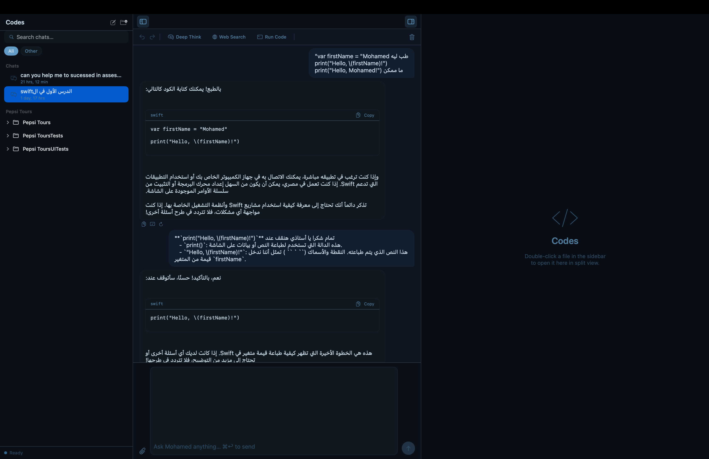
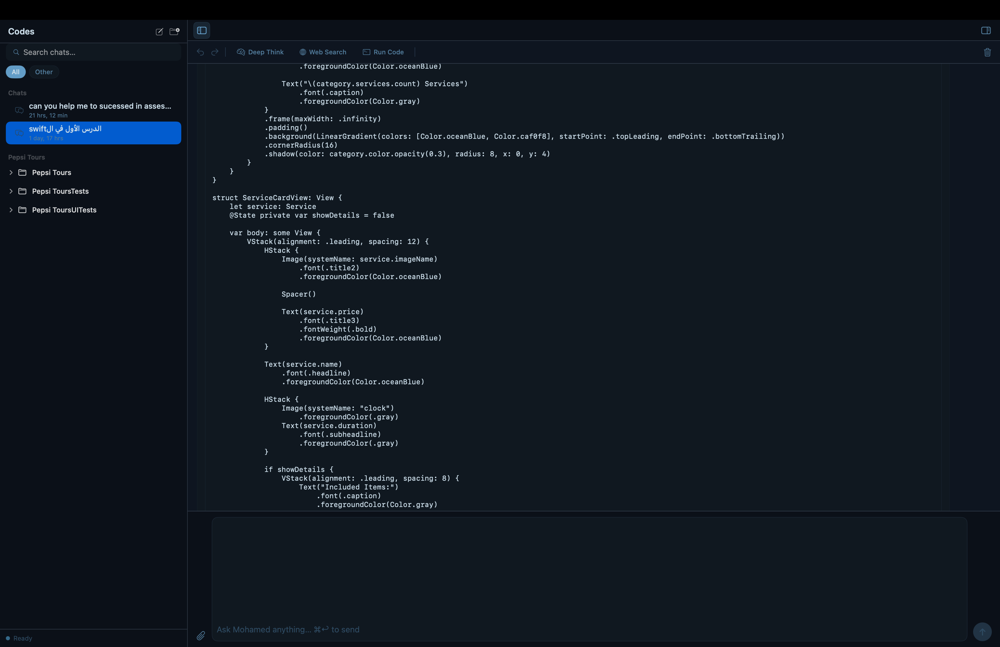

# Codes — AI Coding Assistant for macOS

> A native macOS AI coding assistant that runs 100% locally. No cloud. No API keys. No subscriptions.


---

## What it does

Codes is a personal macOS AI coding assistant powered by local Ollama models. Everything runs on your Mac — your code never leaves your machine.

- 🔧 **Fix Swift files** — send errors, get complete corrected files back
- 💬 **Speaks your language** — Egyptian Arabic, Arabizi, or English — naturally
- 🧠 **Emotional intelligence** — detects tone and responds like a person, not a bot
- 📂 **Project folder access** — reads your Xcode project files directly
- 🖥️ **Split-screen editor** — AI-generated code opens automatically beside your chat
- 🤖 **Smart model routing** — CoreML classifier picks the right model per message
- 🌐 **Web Search** — optional live research injected into AI context
- 🖼️ **Vision support** — attach screenshots of Xcode errors for analysis
- 👍 **Feedback loop** — thumbs up/down trains the classifier on your preferences
- 🔄 **Self-retraining** — CoreML model retrains every 5 conversations, battery-aware
- 📚 **Knowledge database** — versioned Apple platform knowledge (Swift 6, iOS 18, macOS 15)
- ↩️ **Undo / Redo** — full snapshot history for every AI file edit
- 📡 **100% offline** — no internet required, no data leaves your Mac

---

## Screenshots

| Chat | Split Screen |
|---|---|
|  |  |

---

## Smart Model Routing

Codes automatically selects the right model for every message:

| Type | Model | Speed |
|---|---|---|
| Personal / emotional | `llama3.2:3b` | Fast |
| Simple question | `qwen2.5-coder:1.5b` | Fastest |
| Explanation / small fix | `qwen2.5-coder:3b` | Balanced |
| Full file generation | `qwen2.5-coder:7b` | Full power |
| Screenshot / vision | `llava-llama3:8b` | Vision |

A CoreML `TaskClassifier` trained on your conversations drives this routing — and retrains itself every 5 conversations using Apple's CreateML.

---

## Self-Learning System

```
Every conversation
        ↓
LinguisticMemory — stores exchanges as few-shot examples
        ↓
👍 Thumbs up → saved to memory + retraining counter +1
👎 Thumbs down → removed from memory
        ↓
Every 5 conversations → CoreML retrains in background
        ↓
Next session — smarter routing, better tone matching
```

Retraining is battery and thermal aware — skips if battery < 10%, CPU throttled, or device sleeping.

---

## Architecture

```
SwiftUI macOS App
├── 3-panel HStack layout
│   ├── Sidebar        — conversations, file tree, category filters
│   ├── Chat           — streaming AI responses, code cards, feedback
│   └── Split Screen   — live code editor, auto-opens on AI code blocks
│
├── AI Layer
│   ├── OllamaService      — streaming chat, vision, model routing
│   ├── ChatViewModel      — @MainActor state, undo/redo, file ops
│   ├── KnowledgeRouter    — emotion detection, knowledge injection
│   ├── KnowledgeDatabase  — versioned Apple platform knowledge
│   └── ModelUpdater       — CoreML retraining, battery/thermal checks
│
├── Language Layer
│   ├── LinguisticMemory      — few-shot learning from conversations
│   ├── EgyptianDialectDB     — Egyptian Arabic / Arabizi dictionary
│   └── ArabiziTransliterator — Franco-Arabic to Arabic script
│
└── Local Services
    ├── FolderAccessService  — security-scoped file I/O
    ├── FileSystemService    — read/write Swift files
    ├── AttachmentService    — image, PDF, code file handling
    └── WebLearner           — background knowledge fetching (AC only)
```

---

## Required Models

Install via Ollama:

```bash
ollama pull qwen2.5-coder:1.5b-instruct-q4_0
ollama pull qwen2.5-coder:3b
ollama pull qwen2.5-coder:7b-instruct-q4_0
ollama pull llama3.2:3b
ollama pull llava-llama3:8b-v1.1-q4_0
```

---

## Requirements

- macOS 14+
- [Ollama](https://ollama.com) installed and running
- Apple Silicon recommended (M1/M2/M3/M4)
- 16 GB RAM recommended

---

## Why local AI?

- **Privacy** — code never leaves your machine
- **Speed** — no network latency for token streaming
- **Cost** — zero API fees, forever
- **Offline** — works on a plane, no Wi-Fi needed
- **Ownership** — your data, your model, your machine

---

## Tech Stack

| Layer | Technology |
|---|---|
| UI | SwiftUI, adaptive Ocean Blue theme (light/dark/auto) |
| AI Runtime | Ollama local inference |
| Model Selection | CoreML TaskClassifier (self-retraining) |
| Emotional Intelligence | llama3.2:3b tone analysis |
| Vision | llava-llama3:8b |
| Knowledge | KnowledgeDatabase (Swift 6, iOS 18, macOS 15, Xcode 16) |
| Storage | Actor-based JSON persistence |
| Language | Swift 6, macOS 14+ |

---

## License

Copyright © 2026 **Mohamed Youssef El Sayed Hassaan**
All Rights Reserved.

This software and its source code are the exclusive property of Mohamed Youssef El Sayed Hassaan. No part of this software may be reproduced, distributed, modified, or used in any form without express written permission from the owner.

---

*Built by Mohamed Youssef El Sayed Hassaan — Port Said, Egypt*
